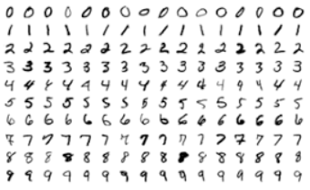

# Convolutional Autoencoder for Image Denoising

## AIM

To develop a convolutional autoencoder for image denoising application.

## Problem Statement and Dataset

The image dataset we taken is mnist and the model must denoise the images and show it with better quality and remove the unwanted noises and learn to show the better version of the images.

Autoencoder is an unsupervised artificial neural network that is trained to copy its input to output. An autoencoder will first encode the image into a lower-dimensional representation, then decodes the representation back to the image.The goal of an autoencoder is to get an output that is identical to the input. MNIST is a dataset of black and white handwritten images of size 28x28.Denoising is the process of removing noise. This can be an image, audio, or document.These noisy digits will serve as our input data to our encoder. Autoencoders uses MaxPooling, convolutional and upsampling layers to denoise the image.



## DESIGN STEPS

### STEP 1:
Download and split the dataset into training and testing datasets

### STEP 2:
Rescale the data as that the training is made easy

### STEP 3:
Create the model for the program , in this experiment we create to networks , one for encoding and one for decoding.


## PROGRAM
```
Developed By: Jegathish S
Register No: 212221230041
```
```
(x_train, _), (x_test, _) = mnist.load_data()

x_train.shape
x_test.shape
x_train_scaled = x_train.astype('float32') / 255.
x_test_scaled = x_test.astype('float32') / 255.
x_train_scaled = np.reshape(x_train_scaled, (len(x_train_scaled), 28, 28, 1))
x_test_scaled = np.reshape(x_test_scaled, (len(x_test_scaled), 28, 28, 1))

noise_factor = 0.5
x_train_noisy = x_train_scaled + noise_factor * np.random.normal(loc=0.0, scale=1.0, size=x_train_scaled.shape) 
x_test_noisy = x_test_scaled + noise_factor * np.random.normal(loc=0.0, scale=1.0, size=x_test_scaled.shape) 

x_train_noisy = np.clip(x_train_noisy, 0., 1.)
x_test_noisy = np.clip(x_test_noisy, 0., 1.)

n = 10
plt.figure(figsize=(20, 2))
for i in range(1, n + 1):
    ax = plt.subplot(1, n, i)
    plt.imshow(x_test_noisy[i].reshape(28, 28))
    plt.gray()
    ax.get_xaxis().set_visible(False)
    ax.get_yaxis().set_visible(False)
plt.show()
     

decoded_imgs = autoencoder.predict(x_test_noisy)
n = 10
plt.figure(figsize=(20, 4))
for i in range(1, n + 1):
    # Display original
    ax = plt.subplot(3, n, i)
    plt.imshow(x_test_scaled[i].reshape(28, 28))
    plt.gray()
    ax.get_xaxis().set_visible(False)
    ax.get_yaxis().set_visible(False)

    # Display noisy
    ax = plt.subplot(3, n, i+n)
    plt.imshow(x_test_noisy[i].reshape(28, 28))
    plt.gray()
    ax.get_xaxis().set_visible(False)
    ax.get_yaxis().set_visible(False)    

    # Display reconstruction
    ax = plt.subplot(3, n, i + 2*n)
    plt.imshow(decoded_imgs[i].reshape(28, 28))
    plt.gray()
    ax.get_xaxis().set_visible(False)
    ax.get_yaxis().set_visible(False)
plt.show() 


```

## OUTPUT

### Parameters for the Model


### Original vs Noisy Vs Reconstructed Image


## RESULT
Thus we have successfully developed a convolutional autoencoder for image denoising application.
